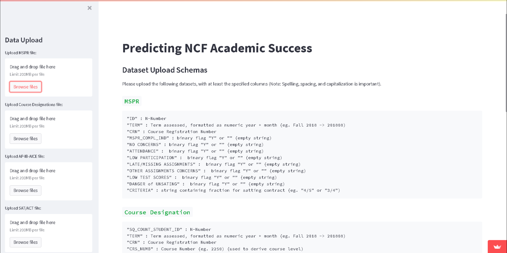
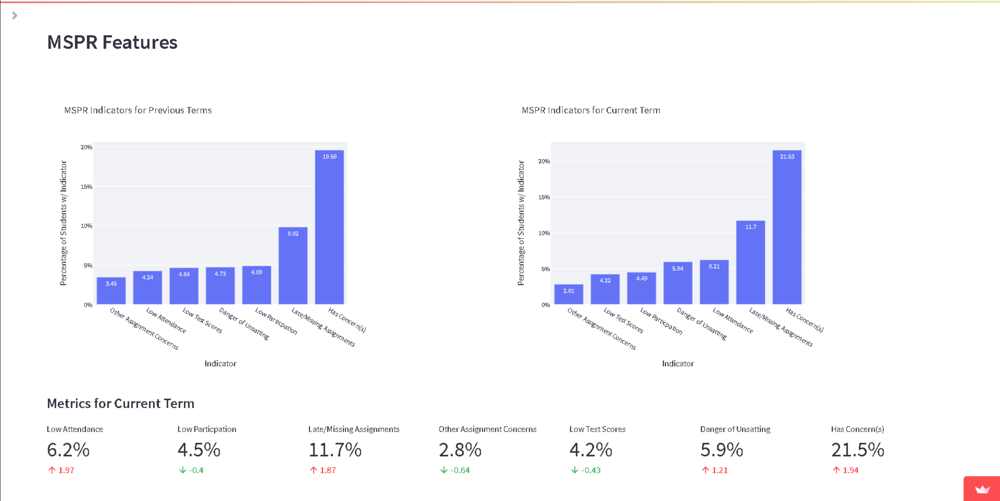
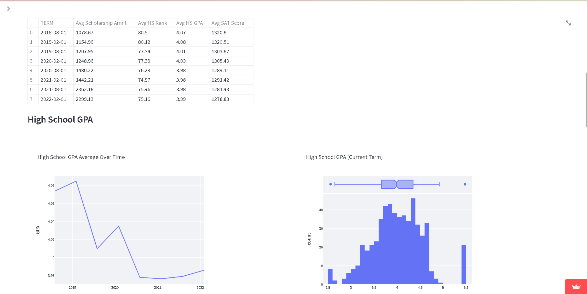
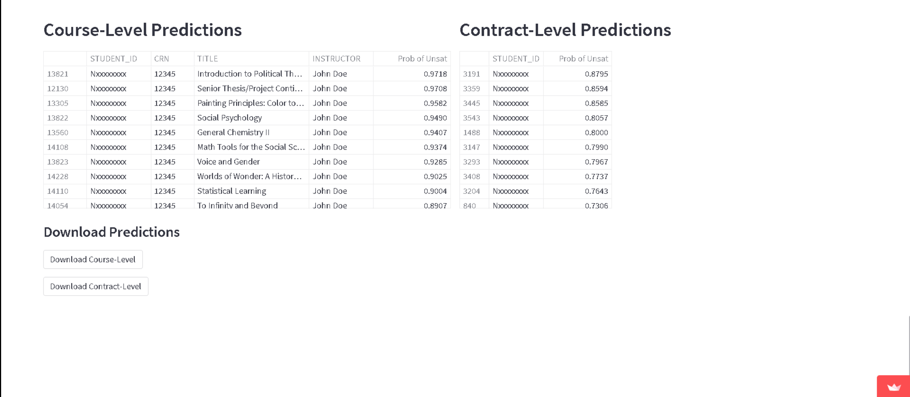
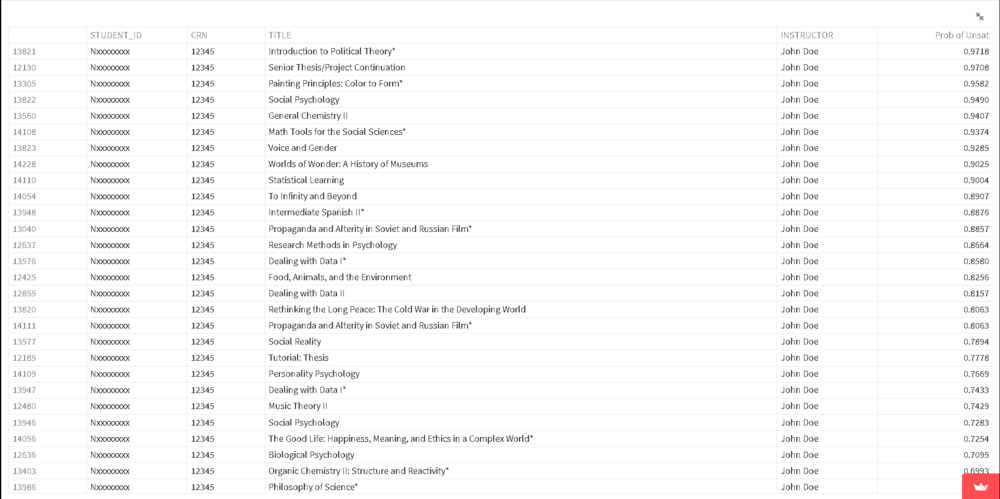

# MSPR_Dash
The object of this application is to use the semesterly survey, filled out by New College of Florida professors, and various other student data points to output valuable insights and predictions of the academic success of the students. Note, this application and the associated models are specific to New College of Florida and will have to be modified to fit any other institution's data.

### Goal/Overview
In order to offer better assistance and targeted outreach for struggling students, NCF began collecting a mid-semester progress report survey (MSPR), filled out by professors, in Fall 2018. The goal is to use this survey about student's performances in each class, along with other data points, to predict if students will pass or fail their courses and/or semester.

### Target Variables
Course designation - Binary indicator for passing/failing a specific course.
Contract designation - Binary indicator for passing/failing a semester.

### Modeling
Numerous models were tested (including multiple logistic regression, random forest, svm, k-nearest neighbors, decision trees, and gradient boosted trees). The final model was picked based on f1-score, due to a class imbalance yielding f1-score more useful than accuracy. This ended up being gradient boosted trees (with LightGBM). 

The model hyperparameters were tuned with Optuna, using 5-fold cross-validation. 

Both median imputing and random forest imputing were tested to impute missing feature values. Since performance metrics were similar, we opted for the simpler median imputing in the final model.

## Dashboard Product
The data preparation steps, some data visualization, and prediction outputs were packaged into a Streamlit application, which exists both as a web browser app and an .exe file. This is to allow administrative and research offices at NCF to easily run the models on future semesters of students.

The app contains a file uploader/browser section on the left-hand side and a input schema on the main page:

After uploading data, some visualizations are displayed to compare student progress to previous semesters:

The predictions are outputted and CSVs can be optionally downloaded (Note: Data in example images are faked for security of students/professors):

